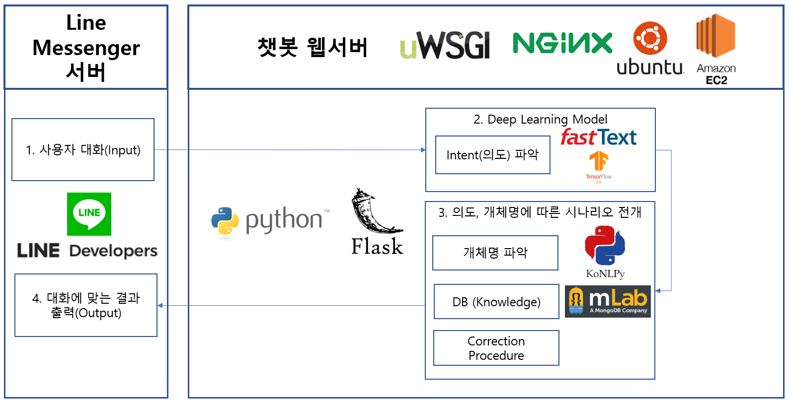

# 딥러닝을 활용한 카페 Chatbot 시스템 구축

## 📔 프로젝트 요약

---

- 캡스톤디자인2 (졸업 프로젝트)

- 팀구성: 개인

- **결과:** 종합 평가 1등(학점 A+)

- 프로젝트 진행 기간: `2020.03 ~ 2020.06`

- **사용 스택**
    - DeepLearning(Tensorflow), CNN
    - Word2Vec(FastText)
    - Mecab(KoNLPy)
    - Flask, Nginx, uWSGI
    - line-bot-sdk
    - MongoDB
    - REST API

- **서비스 주요 기능**
    - Line Messenger 챗봇 서비스 제공
    - 고객의 텍스트 의도 파악
    - 오탈자 처리 기능
    - 제품(음식 또는 음료) 주문 하기
    - 주문 내역 조회/취소
    - 준비완료한 주문 내역 알림 메세지
    - 제품 및 기타 시설 관련 문의하기

## 🤔 프로젝트 동기

---

- 최근 전세계적으로 비정형 데이터인 언어로 이루어진 문장을 처리하고 기계학습에 활용하는 자연어처리 기술 연구가 주목받고 있으며 활발하게 진행중이다.
- 이번 프로젝트에서는 실제 서비스 산업에서 이루어진 대화 데이터를 처리하고 자연어처리 및 딥러닝 기술을 활용하여 사용자의 의도(요청)을 파악하고 적절한 응답을 처리하는 서비스를 개발 목표로 정하였다.
- 다양한 업종 중에서, 서비스 제공 방식이 비대면으로 변경중이고 이미 종업원과의 대화로 진행하지 않아도 충분히 키오스크로 주문 또는 문의가 가능한 서비스를 제공 중인 **카페 업종**을 프로젝트 주제에 적합하다 판단하였으며, **Chatbot 형태**로 서비스 제공 UI로 선정하였다.

## 🔨 프로젝트 설명

---

- **1. 모델 아키텍쳐 구성도**

    

    - 카페 서비스를 이용할 고객은 Line Messenger의 "친구 추가"로 카페 챗봇을 등록한다.
    - 고객은 채팅앱으로 챗봇과 텍스트로 대화를 하며 주문 기능 및 문의 서비스를 제공받을 수 있다.
    - 챗봇 웹서버는 고객의 대화를 분석하고 의도를 파악한 뒤, 의도에 맞는 적절한 답변을 고객에게 채팅앱으로 출력하도록 한다.

---

- **2. 데이터 수집 및 관찰**
    - 실제 고객과 종업원의 대화를 기록한 AIHub의 "한국어대화" 데이터를 신청 및 다운로드하였다.

        

        [한국어대화 | AI Hub](http://www.aihub.or.kr/aidata/85)

    - 데이터의 구조는 고객의 질문과 종업원의 답변으로 이루어져 있으며, 고객의 의도가 라벨링 되어 있다. 다음은 의도별로 카운트한 결과의 일부이다.

        

         → 의도별 데이터 개수

    - 추가로 질문 문장의 길이를 살펴 보았으며, 히스토그램으로 파악하여 시각화하였다.

        

        → 평균적으로 문장의 길이는 약 13개의 음절로 구성되어 있으며 평균을 기준으로 밀집되어 있음을 확인할 수 있다.

---

- **3. 사용자 의도 파악(분류) 딥러닝 모델 학습(1차)**
    - **데이터 전처리**

        1) 10개 미만의 데이터를 가진 의도는 제외하거나 비슷한 의도와 합쳤다. 

        2) 특정 기업의 기능을 포함하거나 서비스 개발에 포함하지 않을 의도는 제외하였다. 

    - **1차 학습 데이터 구성**

        1) 학습할 데이터(질문-의도) 개수: 2346개(학습 데이터 70%, 테스트 데이터 30% 분할) 

        2) 의도 종류: 27개 

        3) 딥러닝 모델에 학습시키기 위해 음절별로 매핑된 숫자로 변환시키며 다음과 같다.

        

        4) 모든 문장의 길이는 평균의 길이인 13을 기준으로 잘라내거나 0으로 추가하였다. 

    - **모델 아키텍쳐**

        1) 미리 한국어 문장을 학습한 Word2Vec(FastText)를 Embedding layer로 선정하였으며 FastText 공식 document 사이트의 vec 파일을 다운 받아 로드하였다. 

        2) 단어를 300개의 dimension으로 이루어진 벡터로 변환 시킨 후, CNN구조를 통해 음절들의 각 구간들의 특징을 추출한다.  

        3) 마지막으로 Fully Connected Neural Network를 거쳐 최종적으로 27개의 의도 중 1개를 파악하는 구조로 설계하였다. 

        

    - **1차 모델 학습 결과**

        

        → 테스트 데이터에 대한 예측 결과 75%의 정확도 성능을 보였고, F1-score 기준으로 데이터가 적은 의도일수록 점수가 대체로 낮았다.

        → 데이터가 적은 의도임에도 불구하고 F1-score가 높은 경우의 질문 문장을 살펴보면 공통된 단어가 들어가 있었다.

---

- **4.  성능 개선 모델 학습(2차)**
    - **개선 방안**

        1) 동일한 단어가 반복되어 나타나는 의도는 챗봇 시스템 구현시 키워드 기반으로 의도를 파악하는 방식으로 구현하는 방안으로 대체한다. 

        2) 딥러닝에 입력되는 문장의 길이를 조절하며 가장 모델 성능이 좋은 길이로 채택한다. 

        3) Hyperparameter Tuning을 진행하여 최적화한다. 

    - **2차 학습 데이터 구성**

        1) 학습할 데이터(질문-의도) 개수: 2014개(학습 데이터 70%, 테스트 데이터 30% 분할) 

        2) 의도 종류: 21개 

        3) 문장 길이: 30음절

    - **2차 모델 학습 결과**

        

        → 테스트 데이터에 대해 약 85%의 정확도 성능을 보여 1차 모델에 비해 성능이 약 10% 높아졌다.

    - **최종 모델 선정**

        1) 2차 모델 학습한 결과 epoch이 288회인 경우가 테스트 데이터에 대해 최고의 정확도 성능을 보였으며, 훈련 데이터와 테스트 데이터에 대한 정확도 차이가 가장 적었던 epoch은 168회 이었다. 

        2) overfitting을 방지하는 동시에 성능을 더 높일 수 있이기 위해 여러 모델을 이용하는 Ensemble 기법을 이용하였으며 epoch이 170회부터 260회 까지 10회 간격으로 증가시키면서 모델을 저장한다. 

        3) 서비스에 모델을 사용할 때 사용자의 문장을 10개의 각 모델에 입력 후에 나오는 10개의 예측값을 모두 고려하여 최종적인 의도를 파악한다. 

---

- **5. 웹서버 구축 및 개발**
    - **웹서버 구성**: 2개로 분리하여 구축 및 운영

        1) Line Developer의 Document를 참고하여 Line-bot-sdk라이브러리를 활용해서 Line Messenger 서버와 통신 및 시나리오를 전개하는 서버 

        2) 사용자의 의도 파악 및 형태소 분석기(Mecab)을 이용하여 분석한 결과를 json형식으로 변환하여 반환하는 REST API 서버

    - **챗봇 시나리오 전개 방식**

        1) 특정 키워드 및 선택 버튼 기반 시나리오 전개 우선 진행 

        2) 만약 특정 키워드가 없는 문장일 경우, 딥러닝 모델을 통한 의도 파악 및 요청 전개 

        3) 형태소 분석기 및 Levenshtein Distance 알고리즘을 활용하여 개체명 및 주문 정보 확인

    - **MongoDB(NoSQL, Document DB) 서버 연동**

        1) 사용자 정보와 주문 정보를 저장 및 수정

        2) 제품 정보(가격, 설명), 문의에 대한 답변을 저장 및 쿼리를 통해 불러옴

---

## 📼 기능별 테스트 화면 & 영상

---

- **주문 기능**

    

    ---

- **메뉴 문의**

    

    ---

- **기타 문의**

    

    ---